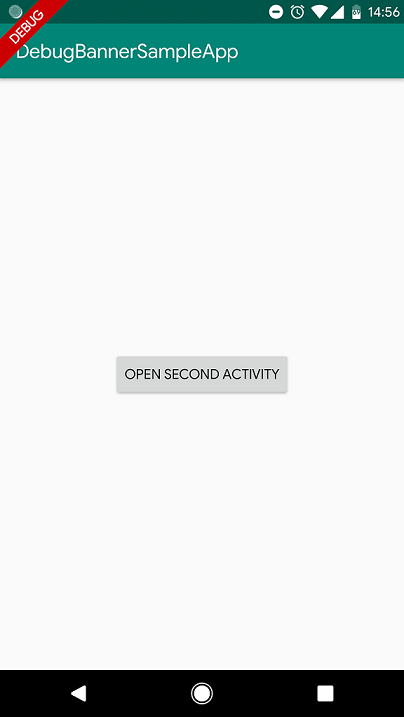
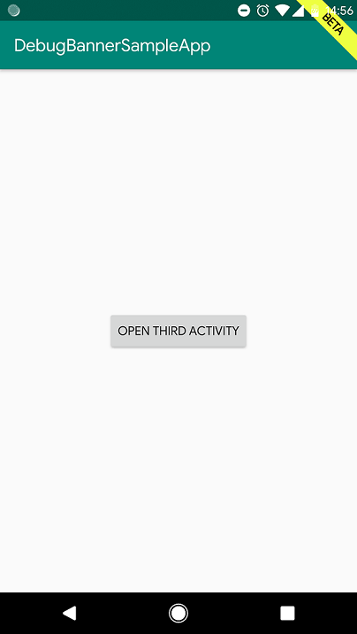

# DebugBanner

Debug banner lib allows you to attach debug (:bug:) banner on all your activities, just by one line of code.

[  ](https://bintray.com/armcha/maven/DebugBanner/_latestVersion)





### Download sample [apk](https://github.com/armcha/DebugBanner/blob/master/screenshots/sample.apk)

The current minSDK version is API level 16.
### Download :arrow_down:
-----------------------
Gradle:
```groovy
implementation 'com.github.armcha:DebugBanner:1.0.4'
```
## Setup and usage

Add it on your application onCreate
```kotlin
  DebugBanner.init(application = this)
```
## Customizations
1. You can change banner color, text, text color and banner gravity

    val bannerGravity: BannerGravity
    val bannerColorRes: Int
    val textColorRes: Int
    val bannerText: Strin

```kotlin
   DebugBanner.init(application = this,
                    banner = Banner(bannerText = "BETA"))
```

2. You can change banner attributes only for one activity. For doing this you just need to implement BannerView interface
```kotlin
   class ExampleActivity : AppCompatActivity(), BannerView {

      override fun createBanner(): Banner {
          return Banner(
                 bannerText = "BETA",
                 bannerColorRes = R.color.yellow,
                 textColorRes = android.R.color.black,
                 bannerGravity = BannerGravity.END)
        }
  }
```
That's all :ok_hand:

## Contact :book:

Pull requests are more than welcome.


:arrow_forward:  **Email**: chatikyana@gmail.com

:arrow_forward:  **Medium**: https://medium.com/@chatikyan

:arrow_forward:  **Twitter**: https://twitter.com/ArmanChatikyan

:arrow_forward:  **Google +**: https://plus.google.com/+ArmanChatikyan

:arrow_forward:  **Website**: https://armcha.github.io/

License
--------

      DebugBanner
      Copyright (c) 2018 Arman Chatikyan (https://github.com/armcha/DebugBanner).

      Licensed under the Apache License, Version 2.0 (the "License");
      you may not use this file except in compliance with the License.
      You may obtain a copy of the License at

         http://www.apache.org/licenses/LICENSE-2.0

      Unless required by applicable law or agreed to in writing, software
      distributed under the License is distributed on an "AS IS" BASIS,
      WITHOUT WARRANTIES OR CONDITIONS OF ANY KIND, either express or implied.
      See the License for the specific language governing permissions and
      limitations under the License.
